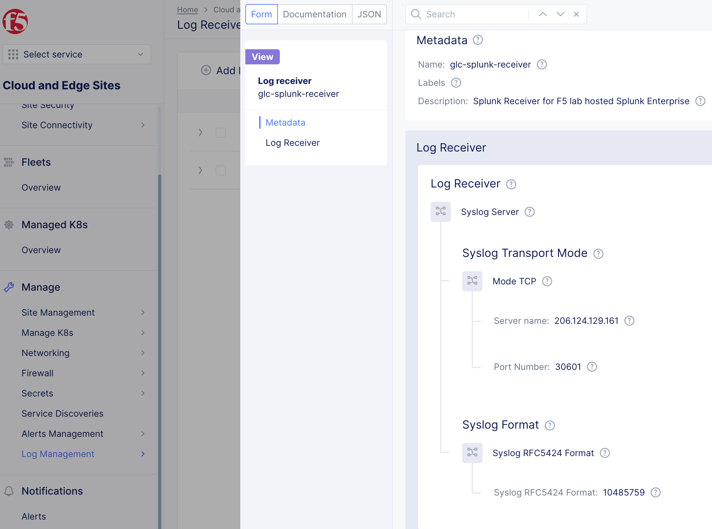

F5 Distributed Cloud Services - Log Receiver Proxy
============================================================================

The F5DCS LogProxy solution creates a intermediary service for an F5DCS logreceiver The proxy provides:

**Log formatting** The F5DCS log receiver currently delivers logs in RFC5424 format excusivley, (refer to image below).  While this may work for some analytics providers, others, (including Splunk), will need to utilize either an additional third-party add-on or customized parser to analyze and model log entries.  The F5DCS LogProxy receives log entries and formats entries into JSON. This enables for easier integration with analtyics vendors.

**Enhanced Log Delivery Security**  The F5DC log 

   
