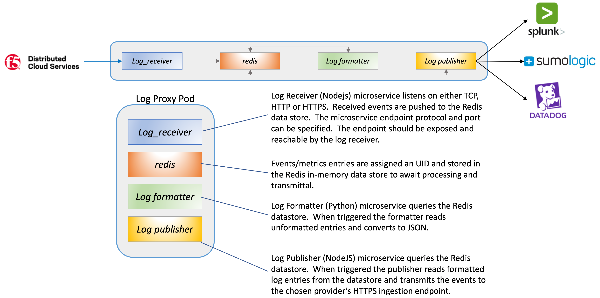

F5 XC - Log Receiver Proxy
============================================================================

The log proxy service is designed to be deployed onto a Kubernetes platform, (including vK8s).  The service pod runs 4 containers providing a self-contained service requiring a single external endpoint for log ingestion.  The service (pod) architecture is illustrated below.  

**Event Processing**
The logProxy service processes events as they are pushed for the XC log receiver.  Entries are processed as they are received.  Once received an entry is temporarily stored in an in-memory datastore.  As soon as a record is stored, the log formatting microservice retrieves the entry, converts the entry to JSON and marks the entry as ready for pushing in the redis datastore.  The log publishing microservice pulls formatted entries from the datastore and delivers, (via an HTTPS post) to the desired analytics/SIEM provider.  While delivery latency is increased, the difference is negligible.

**Log Receiver Protocol Support**
The log receiver can be configured thru environment variables to listen for and respond to TCP, HTTP, or TLS* protocols as well as the listening port.  The specified port represents the pod port that should be exposed and reachable by the log receiver, (see below).

  

Sample F5DCS workload templates are available in the [xcTemplates](https://github.com/gregcoward/logProxy/tree/main/xcTemplates) directory that can be utilized to deploy either a TCP or HTTP Log Proxy service with accompanying load balancer.  Once deployed it is a simple matter of directing the desired log receiver to the exposed endpoint.

**Would be recommended for testing purposes only*

**Analytic Providers Supported**
The Log Proxy service currently supports delivery to Splunk, (via HEC), Sumo Logic and Datadog.  End-users provides either the Splunk endpoint address and HEC token or a Datadog API key.  In both instances, events are delivered in JSON format and easily parsed by either vendor product.

**Scaling**
Each Log Proxy service is a self-contained K8s pod and easily scalable based on demand when placed behind a load balancing/ingress mechanism.

**Required Input Variables** Depending upon the analytics provider utilized, the following input variables are required to be set.  These can be set using either via a Kubernetes configMap, (*example section included in the deploy.yml file*) or using the included *docker-compose.yml* file.

 - **splunk_host**: The Splunk hostname/IP address associated with the [HTTP Event collector](https://docs.splunk.com/Documentation/SplunkCloud/latest/Data/HECExamples) endpoint, *ex: '206.124.134.22'*.  The default HEC port of 8088 w/https is assumed.
 - **splunk_hec**: The [Splunk HEC token](https://docs.splunk.com/Documentation/SplunkCloud/8.2.2201/Config/ManageHECtokens), *ex: 'b5dasdcsd62-02d4-474d-80b5-b25ba198ecb'*.
 - **datadog_token**: The [Datadog API key](https://docs.datadoghq.com/account_management/api-app-keys/), *ex: '507c4941231231215e37asdfsadd16'*. 
  - **sumo_url**: The [Sumo logic custom access URL](https://help.sumologic.com/03Send-Data/Sources/02Sources-for-Hosted-Collectors/HTTP-Source/Upload-Data-to-an-HTTP-Source), *ex: 'https://endpoint1.collection.us2.sumologic.com/receiver/v1/http/ZaVnC4dhaV2GihOv5x8UPmT988-wHV-vK8uUEk3li_2X...'*. 
 - **analytic_provider**:  Specify which analytics vendor to redirect logs towards; select either '*splunk*' or '*datadog*'.
 - **protocol**: Specify either '*tcp*', '*http*', or '*https*' for the log proxy listening endpoint.
 - **listen_port**: The LogProxy listening port, *ex: '30601'.  This is the port to be specified in the F5DCS LogReceiver configuration.

 In addition, the included deployment file for k8s (*deploy.yml*) deploys the pod, configMap, and service.  You will still need to expose the service that it may be reachable from the F5DCS logReceiver.

[^1]: The LogProxy currently supports connections to Splunk Enterprise using the [Splunk HTTP Event Collector](https://docs.splunk.com/Documentation/Splunk/8.2.6/Data/UsetheHTTPEventCollector) (HEC), to Datadog via the [logging endpoint](https://docs.datadoghq.com/api/latest/logs/#send-logs), and to Sumo Logic via a tenant [custom HTTP endpoint](https://help.sumologic.com/03Send-Data/Sources/02Sources-for-Hosted-Collectors/HTTP-Source/Upload-Data-to-an-HTTP-Source).